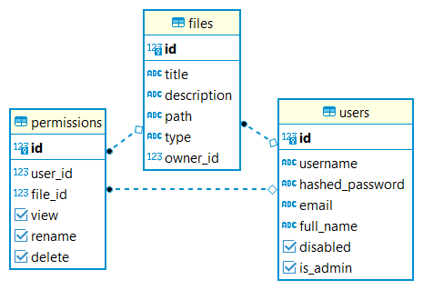

# Blob Storage System

---

**Heroku Deployment Link**: <a href="https://blob-storage-system.herokuapp.com" target="_blank">Blob Storage System</a>

**Video Link**: <a href="https://drive.google.com/file/d/11MFr6Ak-YDwWyU3sGQNvewX-mKkmSWmG/view?usp=sharing" target="_blank">Demo</a>

**Swagger UI**: <a href="https://blob-storage-system.herokuapp.com/swagger" target="_blank">Swagger UI</a>

---

A Simple Blog Storage System for storing files where users can view, upload, rename, delete, share, download and compress files with user based access control on who can access the files.

## ER Diagram:



## Implementation:

<details markdown="1">

<summary>Admin</summary>

* Only admins (ie) users whose 'is_admin' field is true can perform these operation. 
* This is checked using OAuth2 scopes provided by FastAPI.

**GET** <code>/admin/users</code> View all users with all details and the files they own

**GET** <code>/admin/users/{user_id}</code> View a particular user with all details and the files he own

**GET** <code>/admin/files</code> View all files created by users

**GET** <code>/admin/files/{file_id}</code> View a specific file created by an user 

**DELETE** <code>/admin/files/{file_id}</code> Delete a file created by an user

**PATCH** <code>/admin/users/{user_id}/enable</code> Update the 'disabled' field in database to False

**PATCH** <code>/admin/users/{user_id}/disable</code> Update the 'disabled' field in database to True

</details>

<details markdown="1">

<summary>Authentication</summary>

* Authentication happens using OAuth2 with Password (and hashing), Bearer with JWT tokens.

**POST** <code>/token Login</code> Create access token using JWT by supplying username and password.

**POST** <code>/create_session</code> Create a session by supplying the access token so that it could be used later whenever user comes back

**GET** <code>/loggedin</code> To check whether the session is already set (ie) User has already logged in

**POST** <code>/logout</code> To delete the session

</details>

<details markdown="1">

<summary>Users</summary>

**GET** <code>/users</code> View all users but only username and id, no other details are displayed. Can be used for sharing files.

**POST** <code>/users</code> Register user by supplying username and password.

**GET** <code>/users/me</code> View all details about the current user and the files owned.

</details>

<details markdown="1">

<summary>Files</summary>

* Respective operations can only be performed by authorized users.
* This is checked via dependencies in path operation decorators provided by FastAPI.


**GET** <code>/users/{user_id}/files</code> View all files the user owns 

**POST** <code>/users/{user_id}/files</code> 
* Upload a file to the server. 
* The file will be stored in the ***static*** folder with name in the format ***"<user_id>_<unix_timestamp>"*** because a user with a user id can never upload two files at the same time and the path of the file is stored in the database. 
* Content type and name of the file is also stored. ***Shutil*** python library is used to execute this operation.

**GET** <code>/users/{user_id}/files/{file_id}</code> View a specific file only if the user has read permission.

**PUT** <code>/users/{user_id}/files/{file_id}</code> Edit name and description of the file only if the user has edit permission.

**DELETE** <code>/users/{user_id}/files/{file_id}</code> Delete a file only if the user has delete permission.

**PATCH** <code>/users/{user_id}/files/{file_id}/share</code> Share a file with another user only if the user is the owner.

**GET** <code>/users/{user_id}/files/{file_id}/download</code> Download a file only if the user has read permission. File is returned using ***FileResponse*** from ***starlette.responses***.

**GET** <code>/users/{user_id}/files/{file_id}/compress</code> 
* Compress a file into zip and download it only if the user has read permission. 
* ***zipfile*** python library is used and the compression method is ***ZIP_DEFLATED***.

</details>

## Features:

* **Admin access**: Admin access for viewing users and their uploaded files and deleting users and files.
* **Authentication**: Authentication using OAuth2 with Password (and hashing), Bearer with JWT tokens.
* **Authorization**: Authorization using OAuth2 scopes.
* **Access control**: User based access control on who can access the files, rename and delete.
* **Compress Files**: Can compress into zip and download files.
* **Storage**: The files are stored in the 'static' folder with name in the format "<user_id>_<unix_timestamp>" because a user with a user id can never upload two files at the same time and the path of the file is stored in the database.

## Requirements

Python 3.6+

## Installation

```console
$ git clone https://github.com/danieldavidraj/Blob-Storage-System.git

---> 100%
```
```console
$ cd Blob-Storage-System
```
```console
$ pip install -r requirements.txt

---> 100%
```

Run the server with:

```console
$ uvicorn app.main:app

INFO:     Uvicorn running on http://127.0.0.1:8000 (Press CTRL+C to quit)
INFO:     Started reloader process [28720]
INFO:     Started server process [28722]
INFO:     Waiting for application startup.
INFO:     Application startup complete.
```

Go to the <a href="http://localhost:8000" target="_blank">link</a> to see the application